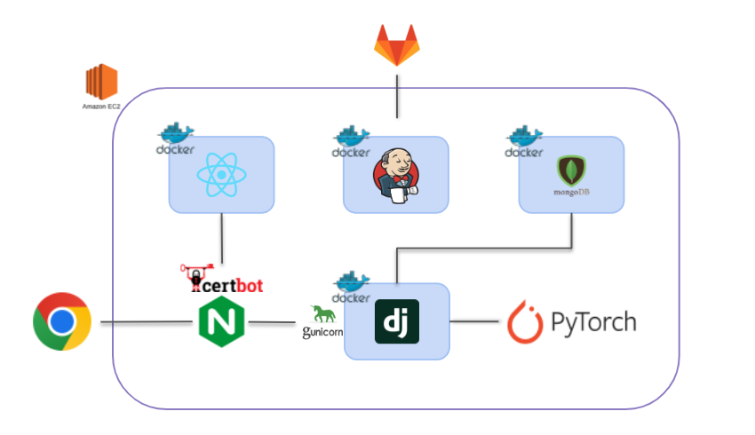

# :scroll: 서비스 소개

> **`SSIFI` 오픈소스를 활용한 시연 서비스 개발**

:black_large_square: **목표**

1. SSIFI 오픈소스 활용도 테스트 및 피드백
2. 입력 데이터와 출력 데이터 확인

# :cowboy_hat_face: 팀 소개 및 역할

|                                    김순요                                    |                                    김치우                                    |                                    박창현                                    |                                   이상백                                    |                                    이재만                                     |                                    홍석준                                     |
| :--------------------------------------------------------------------------: | :--------------------------------------------------------------------------: | :--------------------------------------------------------------------------: | :-------------------------------------------------------------------------: | :---------------------------------------------------------------------------: | :---------------------------------------------------------------------------: |
|  |  |  |  |  |  |
|                            **Frontend 팀장**                            |                                    **AI**                                    |                                 **Frontend**                                 |                                   **AI**                                    |                                  **Backend**                                  |                             **CI/CD Infra**                              |

# :computer: 기술 스택

## :sunny: FrontEnd

|                             HTML                             |                             CSS                              |                              JS                              |                            React                             |                             MUI                              |
| :----------------------------------------------------------: | :----------------------------------------------------------: | :----------------------------------------------------------: | :----------------------------------------------------------: | :----------------------------------------------------------: |
|  |  |  |  |  |

## :moon: BackEnd

|                            django                            |                           mongoDB                            |
| :----------------------------------------------------------: | :----------------------------------------------------------: |
|  |  |

## :star: Infra

|                            nginx                             |                            ubuntu                            |                           AWS EC2                            |                            docker                            |                           Jenkins                            |
| :----------------------------------------------------------: | :----------------------------------------------------------: | :----------------------------------------------------------: | :----------------------------------------------------------: | :----------------------------------------------------------: |
|  |  |  |  |  |

## :satellite: AI

|                                     PyTorch                                     |
| :-----------------------------------------------------------------------------: |
|  |

# :artificial_satellite: 협업 도구

|                            notion                            |                          mattermost                          |                             jira                             |                             git                              |
| :----------------------------------------------------------: | :----------------------------------------------------------: | :----------------------------------------------------------: | :----------------------------------------------------------: |
|  |  |  |  |

# :memo: 서비스 아키텍처

# :star2: 사용예시

## :sparkles: 입장

## :sparkles: 메인

## :sparkles: 시연

# :star2: 주요 기능

## :sparkles: 음성모드

### 녹음

### 전송

### 히스토리

## :star2: 채팅모드

### 채팅

