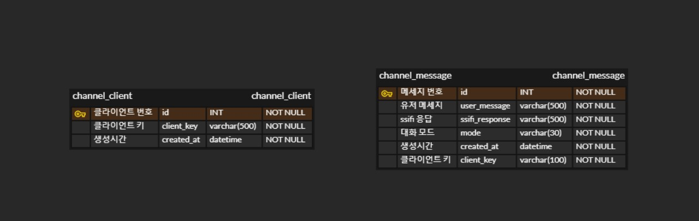

# Install manual

## Frontend

### 사용 기술 및 버전

- React : 18.0.0
- npm : 8.1.2
- node : v16.13.1


### 프론트 파일 실행 시 명령어

```javascript
git clone [Repository Url]

cd frontend

npm install

npm start
```


### /frontend 경로에 .env.local 파일 생성 후 아래 코드 입력

```javascript
REACT_APP_BASE_URL = 'http://localhost:8000/'
```


### 프론트 파일 배포 시 명령어

```javascript
git clone [Repository Url]

cd frontend

npm install

npm run build
```


### /frontend 경로에 .env.local 파일 생성 후 아래 코드 입력

```javascript
REACT_APP_BASE_URL = '{백엔드 API URL:port}'
```


## Backend

### 사용 기술 및 버전

- 개발 언어
  - python 3.7.13
- IDE
  - Visual Studio Code 1.67.2
- 웹 프레임워크
  - django 3.2.13
- DB
  - mongoDB 5.0.8

- 그 외 사용된 패키지는 backend/backend_requirements.txt에 들어있습니다.
- backend에 인공지능 부분이 포함되어 있으므로 backend/requirements.txt도 같이 설치하셔야 합니다.


### ERD




### 가상환경 설정 - Anaconda

backend 폴더(manage.py와 같은 위치)에서 아래의 명령어를 실행합니다. 

```
conda create -n [가상환경 이름] python=3.7 
conda activate [가상환경 이름]
pip install -r backend_requirements.txt
pip install -r requirements.txt
```

- 인공지능을 사용하기 위한 패키지 중 윈도우 환경에서 설치되지 않는 패키지가 포함되어 있으므로 리눅스 환경에서 진행해주셔야 합니다.


backend 폴더(manage.py와 같은 위치)에 `secrets.json` 파일을 만들고 아래의 내용을 추가합니다.

```
{
  "SECRET_KEY": "",
  "CIPHER_V1_KEY": "",
  "DATABASES": {
    "default": {
      "ENGINE": "djongo",
      "ENFORCE_SCHEMA": "True",
      "LOGGING": {
          "version": 1,
          "loggers": {
              "djongo": {
                  "level": "DEBUG",
                  "propogate": "False"
              }
          }
       },
      "NAME": "",
      "CLIENT": {
          "host": "",
          "port": 27017,
          "username": "",
          "password": "",
          "authSource": "",
          "authMechanism": "DEFAULT"
      }
    }
  }
}

```

- `SECRET_KEY` : 장고 프로젝트 생성시 `settings.py `에 등록되어 있는 키를 입력해 주시면 됩니다.
- `CIPHER_V1_KEY` : 암호화를 위한 32바이트 문자열을 입력하시면 됩니다. (영문 32자 등)
- `NAME` , `authSource`: mongoDB 데이터베이스 이름을 입력합니다.
- `host` : mongoDB의 host 주소를 입력합니다.
- `username` : mongoDB 사용 시 만든 유저이름을 입력합니다.
- `password` : mongoDB 사용 시 만든 비밀번호를 입력합니다.
- `port` : 기본 포트는 27017 이지만 변경하였다면 변경한 포트 번호를 입력합니다.


### 실행

```
python manage.py migrate
python manage.py runserver
```


## AI
### 사용 기술 및 버전
- 개발 언어
  - python 3.7.13
- IDE
  - Visual Studio Code 1.67.2
- Linux
  - Ubuntu 20.04 LTS
- 가상환경
  - Anaconda(conda 4.10.3)


### Intall dependencies

해당 설치 과정은 TTS에서 사용되는 패키지의 의존성 문제 때문에 선행으로 진행하게 됩니다.

아래에 설치 커맨드를 순서대로 진행하셔서 패키지를 설치하시면 됩니다.

[PyTorch](https://pytorch.org/)는 본인 환경에 맞게 공식사이트에서 진행하시면 됩니다.

```
# ffmpeg install
pip install ffmpeg

# [WARNING] g2pk를 설치하시기 전에 g2pk github을 참조하셔서 g2pk의 dependency를 설치하시고 g2pk를 설치하시거나, 혹은 아래의 순서대로 패키지 설치를 진행하시기 바랍니다. 
1. pip install wget
2. pip install -v python-mecab-ko
3. pip install jamo
4. pip install konlpy
5. pip install nltk
6. pip install g2pk
```

다음으로, 필요한 모듈을 pip를 이용하여 설치합니다.

```
pip install -r requirements.txt
```

**[WARNING]**

**1. Window에서는 g2pk의 dependency인 python-mecab-ko 설치문제가 발생하며, Window 버전을 설치 하더라도 g2pk 설치시 에러가 발생할 수 있기 때문에 linux 환경을 권장드립니다.**

**2. Anaconda 가상환경을 사용하시는 것을 권장드립니다.**


### usage

서비스에서 사용하기전에 NLP와 TTS는 사전에 학습된 모델을 위치 시킨 후 진행하셔야 합니다.

#### NLP Save Model 

- SSIFI 에서 제공하는 기본모델 : `BASICBOT, NOVELBOT, WELLNESSBOT, PAINTERBOT, KAKAO-KOGPT `

  - BASICBOT 
    - Fine-Tuning 하지 않은 KoGPT2(SKT-KoGPT) Pretrained Model
  - NOVELBOT
    - 소설 데이터를 바탕으로 Fine-Tuning이 진행된 KoGPT2(SKT-KoGPT) Model
  - WELLNESSBOT
    - 심리상담 데이터를 바탕으로 Fine-Tuning이 진행된 KoGPT2(SKT-KoGPT) Model
  - PAINTBOT
    - Fine-Tuning 하지 않은 GLIDE-text2im Pretrained Model(Input 값으로 한국어 텍스트 사용불가)
  - KAKAO-KOGPT6B-ryan1.5b-float16 
    - KAKAO에서 제작되었으며 Fine-Tuning 하지 않은 Pretrained Model
    - half-precision(반정밀도)는 Volta, Turing 또는 Ampere 기반의 NVIDIA GPU가 필요합니다.
    - 최소 16GB 이상 GPU 메모리가 필요합니다. 

- 다음 명령어를 통해 제공 모델을 다운받을 수 있습니다. (모델 저장 위치 : `NLP/models`)

  ```
  python NLP/save_models.py
  ```

#### TTS Pretrained model

- acoustic model
  - pretrained model(checkpoint)을 [다운로드](https://drive.google.com/file/d/1qkFuNLqPIm-A5mZZDPGK1mnp0_Lh00PN/view?usp=sharing)해 주세요.
    그 후, `hparams.py`에 있는 `checkpoint_path` 변수에 기록된 경로에 위치시켜주시면 사전학습된 모델을 사용 하실 수 있습니다.
- vocoder
  - 학습된 VocGAN 모델을 [다운로드](https://drive.google.com/file/d/1GxaLlTrEhq0aXFvd_X1f4b-ev7-FH8RB/view?usp=sharing) 하여 `vocoder/pretrained_models/` 경로에 위치시킵니다.

