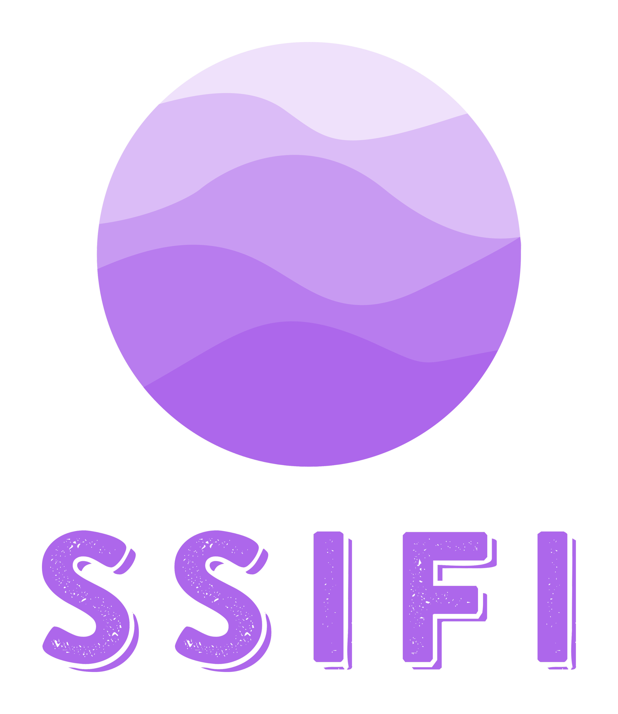

# 나만의 인공지능, 나만의 SSIFI

 

## Intro

이 프로젝트의 목표는 대화형 AI에 대한 접근성을 높이는 것 입니다. 이 오픈소스를 통해서 사용자는 STT, NLP, TTS 기술을 보다 쉽게 사용하실 수 있습니다.

 

## Service

 

해당 서비스는 오픈소스를 바탕으로 제작한 서비스 입니다.

 

## Demo

[SSIFI Demo](https://ssifi-ai.com) 버전은 SSIFI 모델을 사용하여 간단한 기능을 구현한 참고 예제입니다.

 

## Features

SSIFI 시연 서비스는 사용자에게 음성 대화, 채팅 대화 두가지 모드를 제공합니다.

음성 대화 모드는 사용자의 음성을 녹음하여 .wav파일로 서버로 전송하고

전송받은 .wav파일을 서버에서 SSIFI 모델을 통해 STT, NLP TTS를 거쳐

SSIFI의 대답을 응답으로 받게 됩니다.

 

## Built With

### React

### MUI v5

### audio-react-recorder

 

## SSIFI Lib

### "react-markdown": "^8.0.3"

### "react-syntax-highlighter": "^15.5.0"

### "rehype-raw": "^6.1.1"

### "remark-gfm": "^3.0.1",
